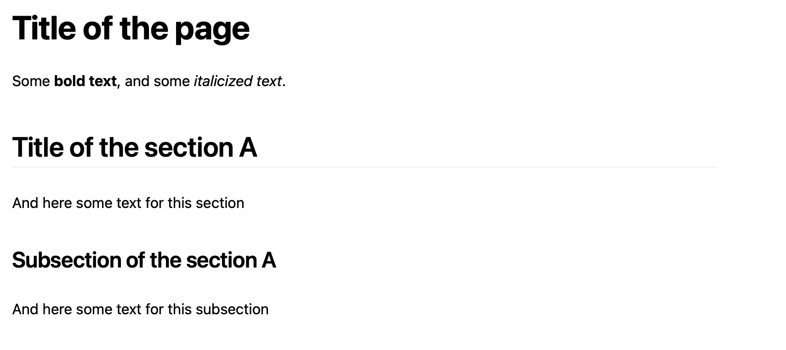
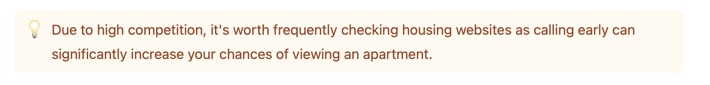
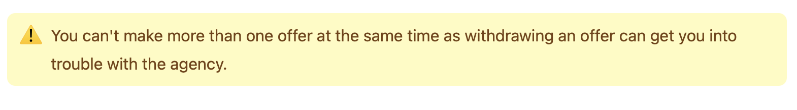

This is the knowledge base of Relocify containing all the information necessary for our clients. All the content lives under `pages` folder and each file that ends with `.mdx` represents page on the website, for example `pages/amsterdam/districts.mdx` is the page accessible under `/amsterdam/districts`.

For formatting the text you have to use markdown syntax, here are all the elements you can use:

# Text formatting
To create a heading, add hash signs (`#`) in front of a word or phrase. So, to add titles to pages use `# Heading level 1`, for titles to separate sections use `## Heading level 2`  and for subsections (to title section inside another section) use `### Heading level 3`. 

To make a text bold just wrap it into two asterisks `**bold**` and if you want to italicize the text, wrap it with one asterisks `*italic*`.

Here is the example:
```markdown
# Title of the page
Some **bold text**, and some *italicized text*. 

## Title of the section A
And here some text for this section

### Subsection of the section A
And here some text for this subsection
```

Which will look like this on the page:


Always put space after `#` and add new lines before and after the header.
<table class="table table-bordered">
  <thead class="thead-light">
    <tr>
      <th>✅&nbsp; Do this</th>
      <th>❌&nbsp; Don't do this</th>
    </tr>
  </thead>
  <tbody>
    <tr>
      <td>
        <code>
            # Here's a Heading
        </code>
      </td>
      <td>
        <code>
            #Here's a Heading
        </code>
      </td>
    </tr>
  </tbody>
</table>

# Adding YouTube Video
To add the video write `<Youtube id="video-id" />` and if YouTube video link is `https://www.youtube.com/watch?v=Ck4ejDDP1gI` then video ID will be `Ck4ejDDP1gI` and to embed this video you will write
```html
<Youtube id="Ck4ejDDP1gI" />
```

# Adding Callout
Callouts are used to emphasize some paragraph, or to give a warning and look like this:



To add them to the page wrap text that you want to be emphesized in `<Callout>` tags as following:
```html
<Callout>
    Some callout text
</Callout>
```

If you want to display  warning callout which looks like this:


You have to add `warning` to the callout element as follows:
```html
<Callout warning>
    Some warning message here
</Callout>
```

## Adding Image
To add an image first you have to upload it by going to `public/img` directory and clicking `Add file -> Upload files` as shown in the gif bellow:


Make sure to call the file some understandable name before uploading, so it's clear what that image is for and what's on it.

After uploading the image go to the page to which you want to add the image and add the following assuming that file that you uploaded was called `some-understandable-name.png`:

```html
<Image src="some-understandable-name.png" />
```
